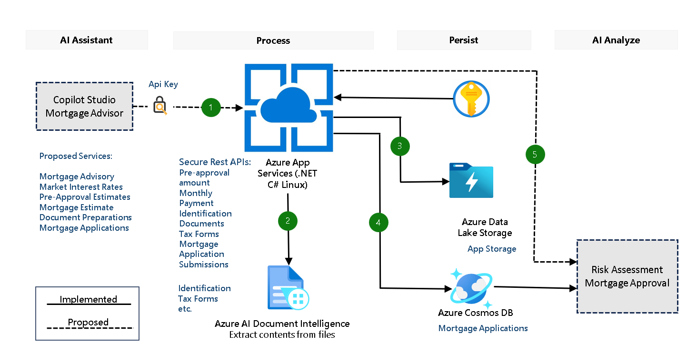

## Sample Secure Rest API App (.NET 8 and C#)

#### Disclaimer

Please note that the architecture of this solution accelerator is built as a start up architecture framework and solution. The code serves as a demonstration only. 

#### Basic features 

Secure Rest APIs hosted in Azure App Service. This is a sample architecture that you can use as your foundational architectural components: Azure Storage, Azure App Services, Azure Document Intelligence, Azure Cosmos DB. More components will be added later such as integration with Azure Open AI or 3rd party LLMs running in Azure. 

#### Current functionality 

(1) Mortgage Calculation and Estimates

(2) Extract information from Documents using Azure Document Intelligence 

(3) Save mortgage loan application into Azure Blob Storage and Azure Cosmos DB

(4) **Secure by design**: 

1. All keys and end points are stored in Azure Key Vault during resource deployment (Deploy to Azure).
2. The client must present api key in each request header, named x-api-key, to access any API hosted in App Services. 
3. Resources accessed by App Services are set from deployment BICEP code using azure identity with 'role assignments'. 

#### Proposed Features 

For initial business use case description, refer to [Proposed Use Case Description](./Deployment/docs/Copilot-AI-Pattern-Mortgage-Advisor-Solution.pdf) for more details. 

If you are interested in enhance the architecture, you can use [Architecture Template](./Deployment/docs/Secure-Rest-Api-App.pptx) as a starting point. 

#### Architecture 

#### Deploy the Architecture to Azure  

**Deploy Code from local sample_app.zip File**

Clone or download the repo to your computer. In your local solution directory, change directory to **Deployment**. Run PowerShell script `deploy_zipfile_local.ps1`. When prompted, provide the file name sample_app.zip which is already in the Deployment directory. 

**Build and Deploy Code from Local (Alternative) - From your .NET C# Development Environment**

In your local solution directory, change directory to **Deployment**. Run PowerShell script `build_zipfile.ps1` to rebuild the solution. Run `deploy_zipfile_local.ps1`  to deploy the new code as .zip file to your app service instance. 

#### **Test the App**

Find the URL of your APP Service in Azure. The API Key is stored in the Azure Key Vault during the initial deployment as a secret named '`x-api-key`'. You can update the key in the key vault after permission/policy is set correctly. When the API client invokes the API, the `x-api-key` value pair must be constructed in the header. You can use swagger interface to test the APIs with the `url` of your App Services instance. 

#### **Trouble Shooting**

If you downloaded or cloned the code locally and want to test the code locally first, you need to set up key vault policy to allow you to read the key and secret in the key vault. You also need to configure this in your `appsettings.json` or `appsettings.Development.json`: "KEY_VAULT_URI": "https://yourvault.vault.azure.net/" so your local instance can access all the keys and end points stored in the key vault. 

